# Cyber-JEPA Phase 4: Code Review & Results Analysis

## 1. Executive Summary

This report documents the review of all codebase components required to run [`run_phase4.py`](file:///e:/jayar/College/Major%20Project/C-JEPA-Phase4/run_phase4.py) and presents a detailed quantitative and qualitative analysis of the experimental results located in [`data/phase4_runs/`](file:///e:/jayar/College/Major%20Project/C-JEPA-Phase4/data/phase4_runs/).

### Key Experimental Takeaways:
1. **Preregistered Gate Verdict**: **Zero survivors** across all 20 runs (4 variants $\times$ 5 seeds). All models were formally rejected by Gate 1 due to latent dimension collapse ($\text{effective\_rank\_fraction} < 10\%$, effective ranks ranging $1.10 - 3.51$ on $D=64$).
2. **Phase 4 vs. Phase 3 Comparison**: No Phase 4 fused-action variant surpassed the frozen Phase 3 separate-action baselines on Out-Of-Distribution (OOD) policy transfer ($\text{B-line} \to \text{Meander}$).
   - **Phase 3 Baseline (`flat_h4_control`)**: Macro-F1 = **$0.8314$**
   - **Phase 3 Baseline (`feature_token_predictor`)**: Macro-F1 = **$0.8309$**
   - **Phase 4 Best (`feature_fused_strict`)**: Macro-F1 = **$0.8235$**
   - **Phase 4 (`flat_fused_strict`)**: Macro-F1 = **$0.8122$**
   - **Phase 4 (`flat_fused_permissive`)**: Macro-F1 = **$0.8086$**
   - **Phase 4 (`feature_fused_permissive`)**: Macro-F1 = **$0.7796$**
3. **Causal Masking Impact**: Strict causal action masking consistently outperformed permissive masking (e.g., $+4.39\%$ F1 gain on feature token representations).

---

## 2. Project File Review: Dependencies of `run_phase4.py`

[`run_phase4.py`](file:///e:/jayar/College/Major%20Project/C-JEPA-Phase4/run_phase4.py) serves as the top-level driver for Phase 4. It enforces strict reproducibility, budget matching against Phase 3 baselines, training across a 5-seed schedule, linear probe evaluations, and preregistered selection reporting.

Below is the structured breakdown of all required modules and assets:

```mermaid
graph TD
    A["run_phase4.py"] --> B["Data Pipeline & Integrity"]
    A --> C["Models & Representations"]
    A --> D["Evaluation & Diagnostics"]
    A --> E["Training & Reproducibility"]

    B --> B1["cyber_jepa.data.dataset"]
    B --> B2["cyber_jepa.data.storage"]
    B --> B3["data/shards & Phase 3 Cohort"]

    C --> C1["cyber_jepa.models.jepa_fused"]
    C --> C2["cyber_jepa.representations.flat"]
    C --> C3["cyber_jepa.representations.feature"]
    C --> C4["cyber_jepa.evaluation.phase4_variants"]

    D --> D1["cyber_jepa.evaluation.capacity_budget_gate"]
    D --> D2["cyber_jepa.evaluation.phase4_runner"]
    D --> D3["cyber_jepa.evaluation.probes"]
    D --> D4["cyber_jepa.evaluation.diagnostics_extended"]
    D --> D5["cyber_jepa.evaluation.leakage_probe"]
    D --> D6["cyber_jepa.evaluation.selection"]

    E --> E1["cyber_jepa.training.trainer"]
    E --> E2["cyber_jepa.utils.reproducibility"]
```

### 2.1 Core Dependencies & Components

| Component / Layer | Key File(s) | Role & Responsibility in Phase 4 |
|---|---|---|
| **Driver Script** | [`run_phase4.py`](file:///e:/jayar/College/Major%20Project/C-JEPA-Phase4/run_phase4.py) | Driver script orchestrating data verification, variant capacity checks, VRAM preflight, seed sweeps (`1001, 2003, 3005, 4007, 5009`), model training, probing, and report generation. |
| **Data Ingestion & Splits** | [`dataset.py`](file:///e:/jayar/College/Major%20Project/C-JEPA-Phase4/src/cyber_jepa/data/dataset.py) [`storage.py`](file:///e:/jayar/College/Major%20Project/C-JEPA-Phase4/src/cyber_jepa/data/storage.py) [`schema.py`](file:///e:/jayar/College/Major%20Project/C-JEPA-Phase4/src/cyber_jepa/data/schema.py) | Implements `CyberJEPADataset`, parquet storage validation (`DatasetStorageManager`), split generation (`generate_group_splits`, `generate_policy_transfer_splits`), normalizer fitting, and trajectory verification (`verify_dataset_integrity`). |
| **Dataset Shards & Cohort** | `data/shards/` `experiments/phase3/phase3_cohort.parquet` `experiments/phase3/phase3_cohort.sha256` | Provides the 15 offline trajectory shards and enforces cryptographic SHA-256 integrity against the frozen Phase 3 dataset cohort. |
| **Model Architectures** | [`jepa_fused.py`](file:///e:/jayar/College/Major%20Project/C-JEPA-Phase4/src/cyber_jepa/models/jepa_fused.py) [`jepa.py`](file:///e:/jayar/College/Major%20Project/C-JEPA-Phase4/src/cyber_jepa/models/jepa.py) | Defines `CyberJEPAFused` which fuses action embeddings directly into observation representations, alongside baseline `CyberJEPA` for parameter budget derivation. |
| **Representations** | [`flat.py`](file:///e:/jayar/College/Major%20Project/C-JEPA-Phase4/src/cyber_jepa/representations/flat.py) [`feature.py`](file:///e:/jayar/College/Major%20Project/C-JEPA-Phase4/src/cyber_jepa/representations/feature.py) | Implements `FlatVectorRepresentation` (vector concats) and `FeatureTokenRepresentation` (structured token preservation). |
| **Variants & Budget Gate** | [`phase4_variants.py`](file:///e:/jayar/College/Major%20Project/C-JEPA-Phase4/src/cyber_jepa/evaluation/phase4_variants.py) [`capacity_budget_gate.py`](file:///e:/jayar/College/Major%20Project/C-JEPA-Phase4/src/cyber_jepa/evaluation/capacity_budget_gate.py) | Configures the 4 fused variants (`flat/feature` $\times$ `strict/permissive`) and verifies that trainable parameter budgets match Phase 3 baselines within strict tolerances. |
| **Training Pipeline** | [`trainer.py`](file:///e:/jayar/College/Major%20Project/C-JEPA-Phase4/src/cyber_jepa/training/trainer.py) [`phase4_runner.py`](file:///e:/jayar/College/Major%20Project/C-JEPA-Phase4/src/cyber_jepa/evaluation/phase4_runner.py) | Implements the optimization loop (`AdamW`, `CosineAnnealingLR`, early stopping with `patience=5`, `min_epochs=10`, `max_epochs=20`), target EMA updates, and execution orchestration (`train_variant`). |
| **Evaluation & Probing** | [`probes.py`](file:///e:/jayar/College/Major%20Project/C-JEPA-Phase4/src/cyber_jepa/evaluation/probes.py) [`metrics.py`](file:///e:/jayar/College/Major%20Project/C-JEPA-Phase4/src/cyber_jepa/evaluation/metrics.py) [`leakage_probe.py`](file:///e:/jayar/College/Major%20Project/C-JEPA-Phase4/src/cyber_jepa/evaluation/leakage_probe.py) | Computes linear probe performance (`LinearProbeEvaluator`) for future compromise prediction on standard test and policy transfer sets; evaluates action degradation (zeroed vs shuffled); checks information leakage. |
| **Diagnostics & Selection** | [`diagnostics.py`](file:///e:/jayar/College/Major%20Project/C-JEPA-Phase4/src/cyber_jepa/evaluation/diagnostics.py) [`diagnostics_extended.py`](file:///e:/jayar/College/Major%20Project/C-JEPA-Phase4/src/cyber_jepa/evaluation/diagnostics_extended.py) [`selection.py`](file:///e:/jayar/College/Major%20Project/C-JEPA-Phase4/src/cyber_jepa/evaluation/selection.py) | Computes effective rank, PCA singular value spectra, cosine similarity, checks collapse criteria (`effective_rank_fraction < 0.10`), and enforces preregistered selection rules. |
| **Reproducibility** | [`reproducibility.py`](file:///e:/jayar/College/Major%20Project/C-JEPA-Phase4/src/cyber_jepa/utils/reproducibility.py) | Sets deterministic seeds for PyTorch, NumPy, Python RNG, and DataLoader workers. |

---

## 3. Analysis of Phase 4 Results (`data/phase4_runs/`)

### 3.1 Overview of Evaluated Models
The experiment evaluated 4 architectural variants across 5 random seeds ($N=20$ total training runs):
1. **`flat_fused_strict`**: Flat observation vector with strict causal masking ($548,032$ parameters).
2. **`flat_fused_permissive`**: Flat observation vector with permissive masking ($548,032$ parameters).
3. **`feature_fused_strict`**: Structured feature tokens with strict causal masking ($521,216$ parameters).
4. **`feature_fused_permissive`**: Structured feature tokens with permissive masking ($521,216$ parameters).

---

### 3.2 Performance Summary Table

| Representation Variant | Trainable Params | OOD Policy Transfer Macro-F1 (Mean $\pm$ Std) | Standard Test Macro-F1 (Mean $\pm$ Std) | Effective Rank (Mean $\pm$ Std) | Effective Rank % | PC1 Var Expl. | PC5 Var Expl. | Beats Persistence | Action Sensitive | Collapsed (Gate 1) |
|---|---:|:---:|:---:|:---:|:---:|:---:|:---:|:---:|:---:|:---:|
| **`feature_fused_strict`** | 521,216 | $\mathbf{0.8235 \pm 0.0120}$ | $\mathbf{0.8719 \pm 0.0085}$ | $1.478 \pm 0.179$ | $2.31\%$ | $89.88\%$ | $99.85\%$ | 0 / 5 | 4 / 5 | **YES (5/5)** |
| **`flat_fused_strict`** | 548,032 | $0.8122 \pm 0.0113$ | $0.8687 \pm 0.0070$ | $1.945 \pm 0.494$ | $3.04\%$ | $79.72\%$ | $99.51\%$ | 1 / 5 | 5 / 5 | **YES (5/5)** |
| **`flat_fused_permissive`** | 548,032 | $0.8086 \pm 0.0179$ | $0.8667 \pm 0.0066$ | $\mathbf{2.502 \pm 0.729}$ | $\mathbf{3.91\%}$ | $66.93\%$ | $99.41\%$ | **3 / 5** | 4 / 5 | **YES (5/5)** |
| **`feature_fused_permissive`** | 521,216 | $0.7796 \pm 0.0413$ | $0.8483 \pm 0.0272$ | $1.503 \pm 0.416$ | $2.35\%$ | $89.23\%$ | $99.71\%$ | 0 / 5 | 5 / 5 | **YES (5/5)** |

---

### 3.3 Comparison with Frozen Phase 3 Baselines

A direct benchmark against the archived Phase 3 reference baselines on policy transfer ($\text{B-line} \to \text{Meander}$) at horizon $k=8$:

| Experiment Phase | Representation / Model | Policy Transfer Macro-F1 (Mean) | Seed 1001 | Seed 2003 | Seed 3005 | Seed 4007 | Seed 5009 |
|---|---|:---:|:---:|:---:|:---:|:---:|:---:|
| **Phase 3 (Frozen)** | `flat_h4_control` | $\mathbf{0.8314}$ | 0.8381 | 0.8257 | 0.8276 | 0.8291 | 0.8363 |
| **Phase 3 (Frozen)** | `feature_token_predictor` | $\mathbf{0.8309}$ | 0.8369 | 0.8333 | 0.8235 | 0.8351 | 0.8255 |
| **Phase 4** | `feature_fused_strict` | $0.8235$ | 0.8347 | 0.8036 | 0.8230 | 0.8303 | 0.8261 |
| **Phase 4** | `flat_fused_strict` | $0.8122$ | 0.7975 | 0.8110 | 0.8078 | 0.8165 | 0.8281 |
| **Phase 4** | `flat_fused_permissive` | $0.8086$ | 0.8241 | 0.8132 | 0.7786 | 0.8074 | 0.8198 |
| **Phase 4** | `feature_fused_permissive` | $0.7796$ | 0.8165 | 0.7517 | 0.8140 | 0.7934 | 0.7221 |

#### Analysis:
- **Baseline Superiority**: The separate-action Phase 3 models (`flat_h4_control`: $0.8314$, `feature_token_predictor`: $0.8309$) outperformed all Phase 4 fused-action variants.
- **Fusion Penalty**: Direct token-level fusion of action embeddings into encoders/predictors did not provide superior inductive bias compared to separate predictor action conditioning.

---

### 3.4 In-Depth Findings from Diagnostic Probes

#### 1. Latent Space Dimensional Collapse (Gate 1 Failure)
- **Constraint**: Preregistered rule Section 12.3 requires $\text{effective\_rank\_fraction} \ge 10\%$ (i.e., $\ge 6.4$ dimensions out of $D=64$) and $\text{median\_std} \ge 0.01$.
- **Result**: While latent variance remained non-zero ($\text{median\_std} \approx 0.23 - 0.83$), the effective rank collapsed into low-dimensional manifolds ($1.10 - 2.50$). PC1 alone explains $66.9\% - 89.9\%$ of total variance, and the top 5 PCs capture $>99.4\%$ of variance.
- **Selection Decision**: [`selection_phase4_only.json`](file:///e:/jayar/College/Major%20Project/C-JEPA-Phase4/data/phase4_runs/selection_phase4_only.json) rejected 100% of candidate models with zero survivors.

#### 2. Strict vs. Permissive Action Masking
- **Strict Masking Dominance**: Strict causal action masking consistently outperformed permissive masking across both representation types.
- **Degradation in Permissive Feature Tokens**: Permissive attention masking on feature tokens caused performance to drop to $0.7796$ OOD Macro-F1 with high cross-seed instability ($\pm 0.0413$), indicating that unconstrained cross-attention between future action queries and past context degrades structured feature representations.

#### 3. Action Sensitivity & Degradation Test
- Under action-zeroing and action-shuffling tests, all variants exhibited increased prediction error ($\text{action\_sensitive} = \text{True}$ across nearly all seeds), proving that the networks actively incorporate action representations rather than ignoring them.

#### 4. Information Leakage Probe
- The unauthorized identity leakage probe yielded a macro-F1 of $0.010 - 0.018$ (chance level $\approx 0.013$), demonstrating that latents do not leak sensitive unobserved attributes.

#### 5. Latent Persistence Baseline
- On trajectories with state changes, most fused models struggled to significantly outperform a naive latent persistence predictor (`beats_persistence` was $0/5$ for feature models and $1/5$ for flat strict), indicating that the learned dynamics still lean heavily on static environmental continuity.

---

## 4. Conclusion & Recommendations

1. **Hypothesis Evaluation**: Fusing action embeddings directly into observation tokens at the encoder level does not resolve representation degradation or improve OOD transfer over Phase 3's separate predictor-conditioned architecture.
2. **Latent Geometry Remediation**: The low effective rank ($1.10 - 2.50$) indicates strong dimensional collapse. Future iterations should explore explicit regularization terms (e.g., VICReg variance/covariance terms or Barlow Twins cross-correlation penalties) during pretraining.
3. **Architectural Direction**: Preserving structured token separation at the predictor stage with strict causal action conditioning remains more effective than direct token fusion.
